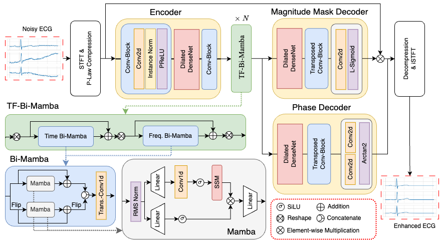
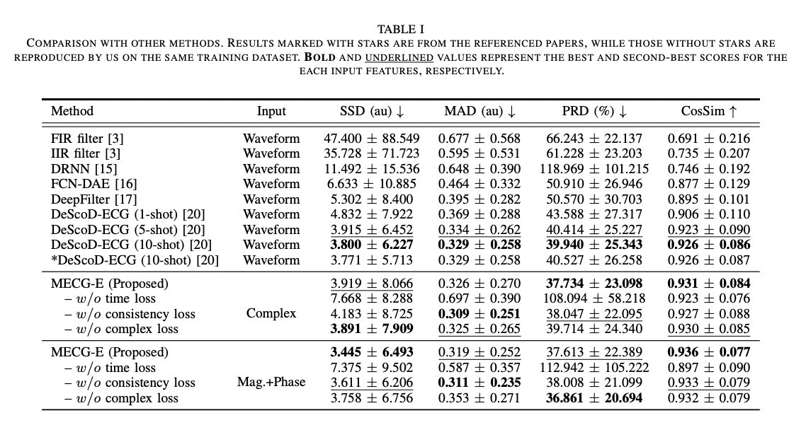

# MECG-E: Mamba-based ECG Enhancer for Baseline Wander Removal

### Abstract
Electrocardiogram (ECG) is an important non-invasive method for diagnosing cardiovascular disease. However, ECG signals are susceptible to noise contamination, such as electrical interference or signal wandering, which reduces diagnostic accuracy. Various ECG denoising methods have been proposed, but most existing methods yield suboptimal performance under very noisy conditions or require several steps during inference, leading to latency during online processing. In this paper, we propose a novel ECG denoising model, namely Mamba-based ECG Enhancer (MECG-E), which leverages the Mamba architecture known for its fast inference and outstanding nonlinear mapping capabilities. Experimental results indicate that MECG-E surpasses several well-known existing models across multiple metrics under different noise conditions. Additionally, MECG-E requires less inference time than state-of-the-art diffusion-based ECG denoisers, demonstrating the model's functionality and efficiency. [[paper](https://arxiv.org/abs/2409.18828)]

<p align="center">

</p>

## Pre-requisites
1. Clone this repository.
2. Install python requirements. Please refer [Requirement](#requirement) and [Installation](#installation).
3. Download and extract the [ECG data](https://drive.google.com/file/d/19qOwywAoxreEv4xONTk-smQdo-ZdoPBc/view?usp=sharing). Clean ECG records from the [QT Database](https://ieeexplore.ieee.org/document/648140) were corrupted using noise profiles from the MIT-BIH Noise Stress Test Database ([NSTDB](https://physionet.org/content/nstdb/1.0.0/)). Dataset preprocessing follows the procedure outlined in [DeepFilter](https://github.com/fperdigon/DeepFilter/tree/master/Data_Preparation).

## Requirement
    * Python >= 3.9
    * CUDA >= 12.0
    * PyTorch == 2.2.2

## Installation
### Create a Python environment with Conda

It is strongly recommended to set up a dedicated Python environment to manage dependencies effectively and prevent conflicts.
```bash
conda create --name mecge python=3.9
conda activate mecge
```

### Install PyTorch

Install PyTorch 2.2.2 from the official PyTorch website. Refer to the [PyTorch Previous Versions](https://pytorch.org/get-started/previous-versions/) section for installation commands tailored to your system configuration (e.g., operating system, CUDA version).

### Install Required Packages

Once the environment is set up and PyTorch is installed, install the necessary Python packages listed in `requirements.txt`.

```bash
pip install -r requirements.txt
```

### Install the Mamba Package

Navigate to the mamba directory and install the package. This step ensures that all required components are properly installed.

```bash
cd mamba
pip install .
```

Note: Installing the package from the provided source (`mamba`) is recommended to prevent dependency issues and ensure compatibility across various packages. Follow these instructions carefully to avoid potential conflicts.

## Code Usage
### Training

1. **Set Hyperparameters:** Update the hyperparameters in the configuration file (.yaml) as needed.
2. **Run the Code:** Execute the following example command (e.g., the configuration file is `MECGE_phase.yaml`):
```bash
python main.py --n_type bw --config config/MECGE_wav.yaml
```

You can download the pre-trained model weights from this [link](https://drive.google.com/file/d/17qAyAJIw0zPFJwtkSsfwB7GeOsylq2_P/view?usp=sharing). Create a folder named model_weight and place the downloaded weight file inside it. We provide the best-performing models for various input features, with their results summarized in the table below.

| <sub>Model</sub> | <sub>Input</sub> | <sub>Loss function</sub> | <sub>SSD (au) $`\downarrow`$</sub> | <sub>MAD</sub> | <sub>PRD</sub> | <sub>Cos_Sim</sub> |
|---    |---    |---            |---  |---  |---  |---      |
| <sub>MECG-E</sub> | <sub>Waveform</sub>   | <sub>$`\mathcal{L}_{time}`$</sub> | <sub>3.906 (6.662)</sub> | <sub>0.360 (0.281)</sub> | <sub>38.949 (22.947)</sub> | <sub>0.929 (0.081)</sub> |
| <sub>MECG-E</sub> | <sub>Complex    | $`\mathcal{L}_{time}`$+$`\mathcal{L}_{cpx}`$+$`\mathcal{L}_{con}`$</sub> | <sub>3.891 (7.909)</sub> | <sub>0.326 (0.270)</sub> | <sub>37.734 (23.098)</sub> | <sub>0.931 (0.084)</sub> |
| <sub>MECG-E</sub> | <sub>Mag.+Phase</sub> | <sub>$`\mathcal{L}_{time}`$+$`\mathcal{L}_{cpx}`$+$`\mathcal{L}_{con}`$</sub> | <sub>3.445 (6.493)</sub> | <sub>0.319 (0.252)</sub> | <sub>37.613 (22.389)</sub> | <sub>0.936 (0.077)</sub> |

### Testing
Training the model from scratch will automatically include the testing stage. For cases where the pretrained weights are already available (e.g., downloaded the pretrained weights), and retraining is not required, use the following command:

```bash
python main.py --n_type bw --config config/MECGE_wav.yaml --test
```

### Evaluate the Result
Evaluate the result of multiple configuration files (e.g., `MECGE_phase.yaml` and `MECGE_complex.yaml`).
```bash
python cal_metrics.py --experiments MECGE_phase MECGE_complex
```

Note: If you download the data from our provided [link](https://drive.google.com/file/d/19qOwywAoxreEv4xONTk-smQdo-ZdoPBc/view?usp=sharing), you can directly reference the results listed in Table below without additional training.

<p align="center">

</p>


## License
This project is licensed under the MIT License - see the [LICENSE](LICENSE) file for details


## Citation

If you find the code helpful, please cite the following article.
```
@article{hung2024mecg,
  title={MECG-E: Mamba-based ECG Enhancer for Baseline Wander Removal},
  author={Hung, Kuo-Hsuan and Wang, Kuan-Chen and Liu, Kai-Chun and Chen, Wei-Lun and Lu, Xugang and Tsao, Yu and Lin, Chii-Wann},
  journal={arXiv preprint arXiv:2409.18828},
  year={2024}}

```

## Acknowledgments
* We acknowledge that our code is heavily based on implementations provided in several GitHub repositories ([DeepFilter](https://github.com/fperdigon/DeepFilter/tree/master/Data_Preparation), [DeScoD-ECG](https://github.com/HuayuLiArizona/Score-based-ECG-Denoising) and [SEMamba](https://github.com/RoyChao19477/SEMamba)), and we extend our gratitude to the respective authors for making their work publicly available.
* [Bio-ASP Lab](https://bio-asplab.citi.sinica.edu.tw), CITI, Academia Sinica, Taipei, Taiwan